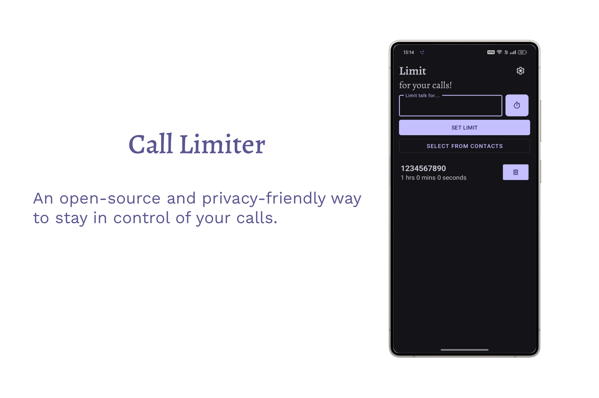
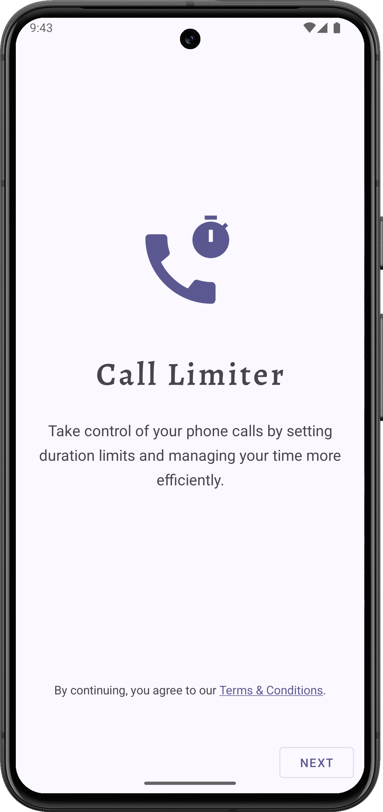
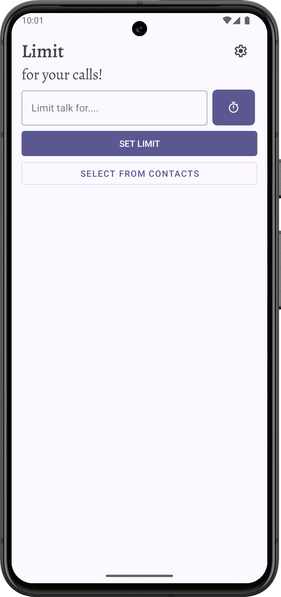
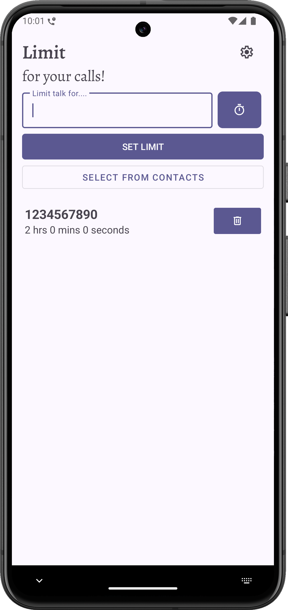
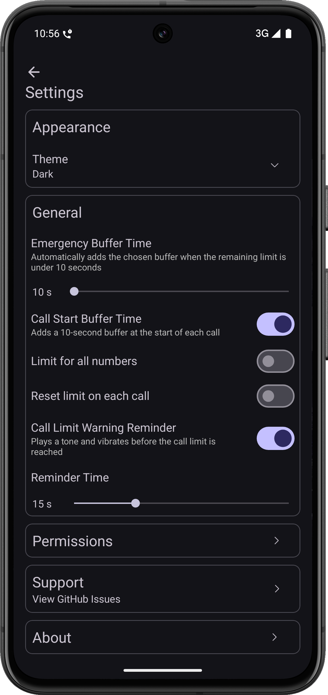

# Call Limiter

Call Limiter is an Android application designed to help users set a time limit for phone calls to specific contacts. This app ensures calls do not exceed the defined duration, making it easier to manage call times effectively.

  

    

## 🌟Features

  
  
  
  

  

- 🔢 **Set time limits** for specific phone numbers
- 📴 **Auto-disconnect calls** when the limit is reached
- 🎡 **Bottom sheet wheel selector** for choosing time duration
- 📂 **Persistent storage** – limits remain saved until deleted
- 🗑️ **Delete or edit limits** for specific numbers anytime
- 🎨 **Dark & Light themes** with system theme support
- ⚡ **Emergency Buffer Time** (extra seconds for critical calls)
- 🔒 **Privacy-first** – works fully offline, no data is ever shared

## ⚒ How It Works

1. **Enter a Phone Number**: Manually input a valid number or select from contacts.
2. **Set a Time Limit**: Choose a duration using the bottom sheet timer.
3. **Save the Limit**: The app stores the number and its corresponding time limit.
4. **Monitor Calls**: Calls to the saved number will be restricted based on the set time.
5. **Delete a Limit**: Users can remove the time restriction for a number anytime.

This app is ideal for managing call durations effectively, whether for personal use or controlling excessive call times.

## 🔐 Permissions Used

Call Limiter requires the following Android permissions:

- **READ_PHONE_STATE** → Detect ongoing calls
- **READ_CALL_LOG** → Identify call history for managing limits
- **CALL_PHONE** → Disconnect calls when limit is reached
- **ANSWER_PHONE_CALLS** → End calls programmatically
- **POST_NOTIFICATIONS** → Show reminders and call limit alerts
- **FOREGROUND_SERVICE** → Run safely in the background

> ✅ These permissions are **only used to enforce your call limits**.  
> ✅ The app works **fully offline**.  
> ✅ **Your privacy is our top priority** – no personal data is ever collected or shared.

## ⚙️ Settings

- 🌓 **Theme Selection** → Choose System / Light / Dark mode
- ⏳ **Emergency Buffer Time** → Add 10s – 5min extra if needed
- 📜 **Permissions Page** → View and manage required app permissions
- 🆘 **Support / Help** → Redirect to GitHub Issues for reporting bugs
- ℹ️ **About** → Author, Repository, Change Log, Terms & Conditions and Privacy Policy

## 🤝 Contributing

Want to make **Call Limiter** even better? Here’s how you can help:

- 💡 **Suggest Features** – Have an idea to improve the app? [Open a GitHub Issue](../../issues) and share your suggestion.
- 🐞 **Report Issues** – Spotted a bug? [Log it on GitHub](../../issues) so it can be fixed in future updates.
- ⭐ **Support the Project** – If you find this project useful, consider giving it a star to show your support.

## ❤️ Sponsor
The app is open-source, free to use, and contains no ads. Your support helps sustain full-time development.
- 🍵 [Buy Me A Coffee](https://www.buymeacoffee.com/thirumalaikg)

## 💡 Credits
- [FoodYou](https://github.com/maksimowiczm/FoodYou) - I shamelessly x2 borrowed inspiration from this project.

